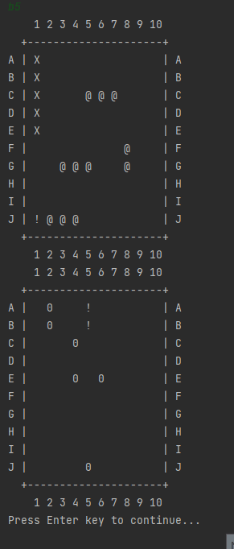

# Batleships OOP

It's a classic battleships game based on pencil and paper version. 

Each player receives a game board and five ships of varying lengths. Each ship has parts. The five ships are:

- Carrier, which has five parts

- Battleship, which has four parts

- Cruiser, which has three parts

- Submarine, which has three parts

- Destroyer, which has two parts

It's a console game and it has two phases: placing ship and shooting phase. TODO: add JavaFx.

Example gameplay:

